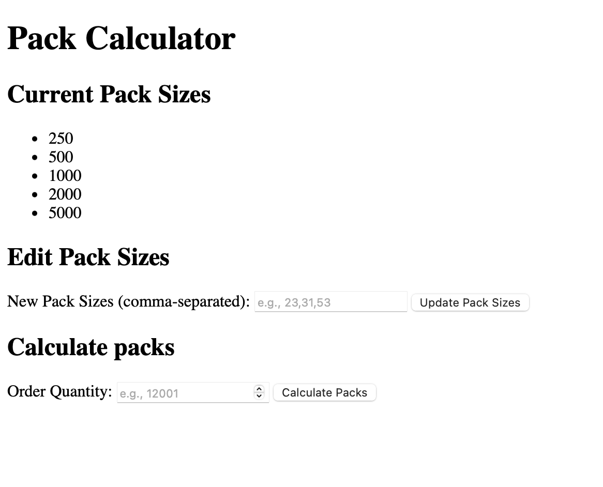

# Coding challenge

I chose RESTful API. I added a UI as well. The user is able to get an overview the pack sizes,
modify them and calculate the required amount of packs


## The algorithm 

1. The pack sizes are sorted in the reverse order
2. We iterate over the pack sizes and divide the ordered quantity by the pack size to find out the quotient and the remainder
3. Next, using the quotient we add a number of packs to the result and using the remainder decide whether we can stop iterating immediately (remainder is less than the small pack size), or we need to iterate further
4. After the initial iteration is done, we replace packs with the same size with bigger-sized packs to optimize the pack count


## Build & Run

Running with Docker
```bash
docker build -t challenge .
docker run -it -p 8080:8080 --rm challenge
```

Running with GNU Make
```bash
make dev
```

Running with Go:
```Bash
go build -o bin/cmd cmd/main.go
bin/cmd
```

## How to use

* UI: https://stark-river-82961-278b69188afd.herokuapp.com


* In case you would like to use the API, sample curls: 
```bash 
curl --location --request POST 'https://stark-river-82961-278b69188afd.herokuapp.com/api/v1/calculate_packs' \
--header 'Content-Type: application/json' \
--data-raw '{
"order_quantity":10
}'
```

Change the packs
```bash 
curl --location --request PUT 'https://stark-river-82961-278b69188afd.herokuapp.com/api/v1/pack_sizes' \
--header 'Content-Type: application/json' \
--data '{
    "pack_sizes":[23,31,53]
}'
```

Get the packs
```bash 
curl --location --request GET 'https://stark-river-82961-278b69188afd.herokuapp.com/api/v1/pack_sizes' 
```

### Dependency Versions
* GNU Make 3.81 (optional)
* Go 1.21