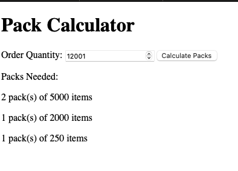

# Coding challenge

I chose RESTful API. I added a UI as well. 
And you can configure the pack sizes without having to 
change the code as they are located in the `conf.json` configuration file.

## Build & Run
Running with GNU Make
```bash
make dev
```

Running with Go:
```Bash
go build -o bin/bin cmd/main.go
bin/bin
```

## How to use

* UI: http://localhost:8080 (you can change the port in your `conf.json` file)


* In case you would like to use the APIm the  endpoint to calculate the packs is POST http://localhost:8080/api/v1/calculate_packs

Sample curl
```bash 
curl --location --request POST 'localhost:8080/api/v1/calculate_packs' \
--header 'Content-Type: application/json' \
--data-raw '{
"order_quantity":10
}'
```

### Dependency Versions
* GNU Make 3.81 (optional)
* Go 1.21